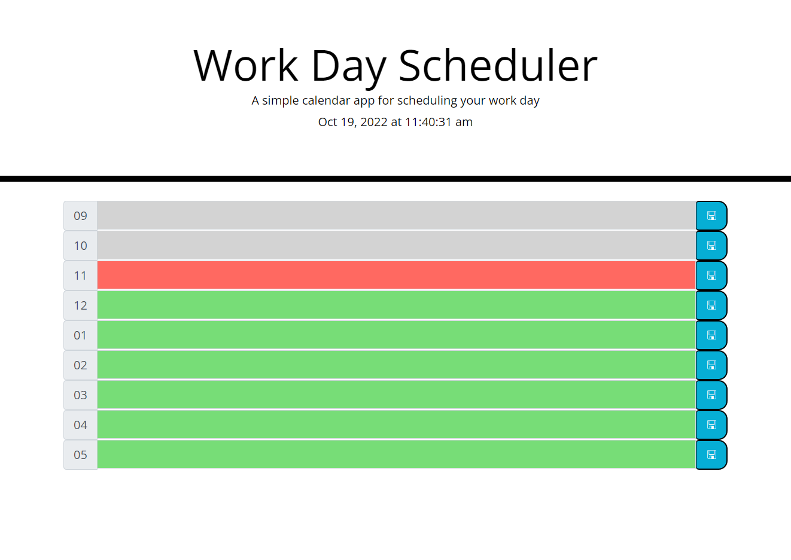

# Schedulerme

Schedulerme is a workday scheduler intended to keep you on task throughout your workday.

## URL

https://jcool221.github.io/Schedulerme/

## Usage

Populate the bars the with your tasks for the day and hit save.  As the day progresses the each bar will change dynamically from green to red as the designated hour arrives and finally to gray after the hour has passed.

## URL

https://jcool221.github.io/Schedulerme/

## Screenshot

## Contributing
Pull requests are welcome. For major changes, please open an issue first to discuss what you would like to change.

Please make sure to update tests as appropriate.

## Credits

By Josh Cooley

## License
[MIT](https://choosealicense.com/licenses/mit/)
